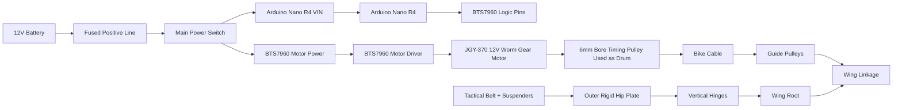
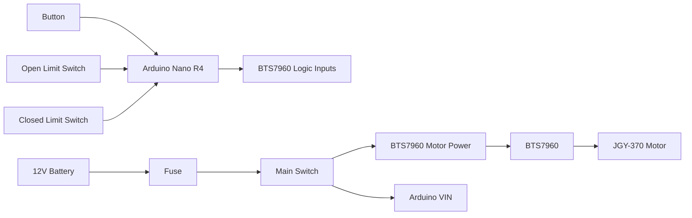
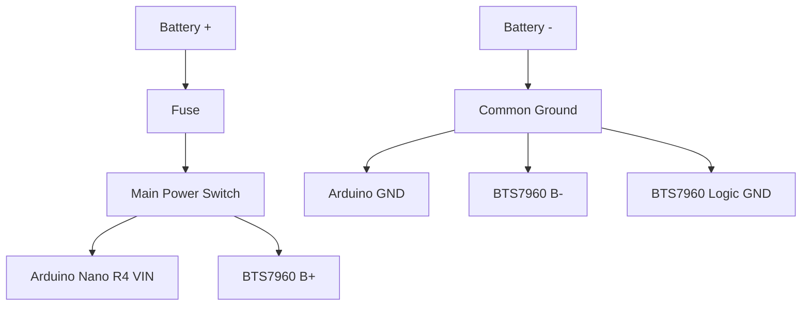
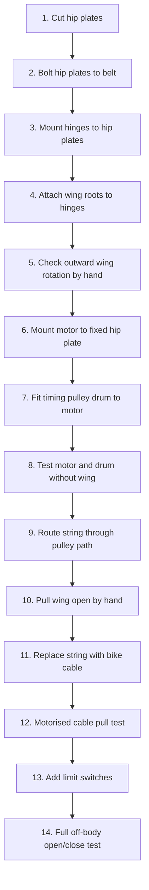
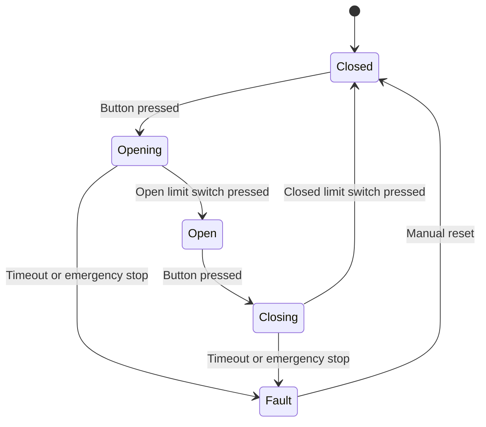

# Motorised Folding Hip-Wing System

## Scope and Purpose

This project is a prototype motorised folding wing system for a cosplay costume.

The goal is to build a pair of lightweight wings mounted near the hips that can:

1. Sit securely on a belt/harness structure.
2. Rotate outward from the hips using vertical hinges.
3. Fold open and closed using a cable-and-pulley mechanism.
4. Be driven by a 12V DC worm gear motor.
5. Be controlled by an Arduino Nano R4 and BTS7960 motor driver.

This is a working prototype, not a finished production mechanism. The electronics are relatively straightforward. The main engineering risk is mechanical: mounting the wings securely, choosing the correct cable attachment point, and preventing the belt/wing structure from twisting under load.

---

## Project Priorities

Because this is being built under a short deadline, the priority order is:

1. Make the wings wearable.
2. Make the wings structurally secure.
3. Make the wings rotate outward from the hips.
4. Make the wings open and close under motor power.
5. Improve neatness, speed, and cosmetics only after the mechanism works.

A functioning prototype is more important than a perfect mechanism.

---

## System Overview



---

# Materials and Components

## Mechanical Components

### Wing and Frame

- Existing folding wing frame
- White tube / pipe wing spars
- Metal mending plates / strips
- Bolts, washers, and nuts for pivots
- Nyloc nuts or threadlocker
- EVA foam or costume covering material

### Belt and Hip Mounting

- LUUFAN-style tactical MOLLE belt or equivalent
- Shoulder strap / suspenders if available
- BAKI commercial plastic cutting board, 18 x 12 x 0.5 inch, used as rigid HDPE hip-plate material
- Large penny washers
- M5 or M6 bolts
- M5 or M6 nyloc nuts
- Optional smaller inner backing plates
- Optional rear brace:
  - aluminium flat bar,
  - steel mending strip,
  - plywood strip,
  - or spare HDPE strip.

### Hinges and Rotation

- Two small vertical hinges per wing if possible
- Alternatively, one stronger vertical hinge per wing
- Bolts, washers, and nyloc nuts for hinge mounting
- Physical hard stops for open and closed wing positions
- Rubber bumpers or washer stacks for stops if available

### Cable and Pulley System

- Bike cable / braided steel cable
- Cable ferrules / crimps
- Cable thimbles
- Cable clamps if needed
- 30mm nylon U-groove ball-bearing pulleys
- Heavier steel pulleys for prototyping if already available
- 20T 6mm bore aluminium timing pulley used as temporary motor drum
- Small screws/bolts for pulley mounting

---

## Electrical Components

- Arduino Nano R4
- BTS7960 / IBT-2 motor driver
- JGY-370 12V DC worm gear motor, 6 RPM
- 12V battery source
- Fuse holder
- Suitable fuse
- Main power switch
- Push button
- Limit switches
- LEDs for testing
- 220Ω resistors for LED testing
- 22 AWG stranded silicone wire for signal wiring
- Heavier wire for motor power, ideally 18–20 AWG
- Heat shrink tubing
- Terminal blocks or connectors
- Solder
- Soldering iron
- Multimeter

---

# Mechanical Build

## Mechanical Design Principle

The belt does not directly carry the wing hardware.

The belt holds a rigid structure against the body. The rigid structure carries the hinge, motor, pulleys, and wing load.

The correct structural chain is:

```text
Body / hips
↓
Tactical belt + suspenders
↓
Outer rigid hip plate
↓
Vertical hinge
↓
Wing root bracket
↓
Folding wing frame
```

The belt is for wearing the mechanism.

The rigid hip plate is what the mechanism actually mounts to.

---

## Belt and Hip Structure

Use the plastic cutting board as the rigid hip-plate material.

Cut the board into two outer hip plates.

Suggested size per plate:

```text
Height: 200-250mm
Width: 100-150mm
Thickness: 0.5 inch / about 12.7mm
```

Do not make the plates too small. Larger plates spread the load better and provide more room for:

- hinge mounting,
- motor mounting,
- pulley mounting,
- cable routing,
- belt bolts.

The plates should sit on the outside of the belt.

```text
Outside of body

[ hinge / motor / pulley hardware ]
          ↓
[ outer plastic hip plate ]
          ↓
[ tactical belt fabric ]
          ↓
[ large penny washers or inner backing plate ]
          ↓
[ nyloc nuts ]

Inside of body
```

---

## Cutting the Hip Plates

Recommended tool:

```text
Jigsaw
+
fine-tooth wood/plastic blade
```

Acceptable alternatives:

```text
Hacksaw
Fine-tooth hand saw
Oscillating multi-tool
```

Avoid:

```text
Stanley knife
Angle grinder
Circular saw unless experienced
```

Cut rough rectangles first. Do not waste time shaping them elegantly until the mechanism works.

Suggested process:

1. Mark two rectangles on the cutting board.
2. Clamp the board securely.
3. Cut slowly with a jigsaw or hacksaw.
4. Round sharp edges with sandpaper or a file.
5. Drill holes only after the plates are cut.

---

## Attaching Hip Plates to the Belt

Each hip plate should be bolted through the belt.

Use four bolts per hip plate if possible.

```text
Outer hip plate:

┌────────────────────┐
│  O              O  │
│                    │
│                    │
│  O              O  │
└────────────────────┘
```

Recommended hardware:

```text
M5 or M6 bolts
Large penny washers
Nyloc nuts
```

Bolt stack:

```text
Outside of body

Bolt head
↓
Outer plastic hip plate
↓
Tactical belt fabric
↓
Large penny washer or inner backing plate
↓
Nyloc nut

Inside of body
```

A smaller inner backing plate is better than washers alone because it spreads the load over more belt material.

Best version:

```text
Outer large hip plate
↓
Belt
↓
Smaller inner backing plate
↓
Nuts
```

Minimum acceptable version:

```text
Outer large hip plate
↓
Belt
↓
Large penny washers
↓
Nuts
```

Do not screw the hinge directly into the belt fabric.

---

## Optional Rear Brace

If time allows, connect the left and right hip plates across the back.

```text
Left hip plate ───── rear brace ───── right hip plate
```

This makes the belt behave more like a rigid waist frame.

Useful materials:

```text
Aluminium flat bar
Steel mending strip
Plywood strip
Spare HDPE strip
```

This is strongly recommended if the wings are heavy or long, because it reduces twisting and sagging.

---

## Hinge System for Outward Rotation

The wing should rotate outward from the hip using a vertical hinge.

The hinge pin must be vertical, like a door hinge.

Top view:

```text
Body / hip
   │
   │ outer hip plate
   │
   O  vertical hinge pin
    \
     \
      wing swings outward
```

Use two hinges per wing if possible.

Side view:

```text
Outer hip plate:

┌────────────────────┐
│  [ upper hinge ]   │
│                    │
│  [ lower hinge ]   │
│                    │
└────────────────────┘
```

Two hinges resist twisting better than one hinge.

The hinge structure should be:

```text
Outer hip plate
↓
Vertical hinge
↓
Wing root bracket
↓
Folding wing frame
```

---

## Hinge Stops

The hinge needs hard stops.

Without stops, the wing can rotate too far and damage the cable, linkage, belt, or wearer.

Minimum stops:

```text
Closed stop:
Prevents the wing folding too far into the body.

Open stop:
Prevents the wing rotating too far outward.
```

Simple emergency stop options:

```text
Bolt used as a stop peg
Rubber bumper
Washer stack
Small metal bracket
Wood/plastic block
```

The motor should never be allowed to pull indefinitely against a hard stop. Limit switches should eventually stop the motor before or at the stop point.

---

# Pulley and Cable System

## Cable Drive Principle

The motor does not directly move the wing.

The motor rotates a drum. The drum winds the cable. The cable pulls a moving linkage point on the wing. That movement opens the wing.


The most important rule:

```text
Pulleys guide the cable.
The cable endpoint moves the wing.
```

Do not attach the cable at every bolt.

Do not put a pulley at every joint just because there is a bolt there.

---

## Motor Drum

Use the 20T 6mm bore aluminium timing pulley as a temporary drum.

It should fit the JGY-370 motor shaft if the motor shaft is 6mm.

The timing pulley must be secured to the motor shaft using its grub screws.

```text
Motor shaft
↓
6mm bore timing pulley
↓
Grub screws tightened onto shaft
```

The grub screws secure the pulley to the motor shaft.

They do not secure the bike cable to the pulley.

---

## Securing the Bike Cable to the Drum

The cable must be fixed to the drum so that the drum winds the cable rather than slipping underneath it.

Do not rely on friction alone.

Prototype methods:

### Method A: Drill-and-clamp

```text
Drill small hole in pulley flange
↓
Pass bike cable through hole
↓
Clamp or crimp cable
↓
Wrap cable around pulley
```

### Method B: Crimped loop

```text
Bike cable
↓
Loop around a small bolt/hole on the drum
↓
Ferrule/crimp secures loop
↓
Cable wraps around pulley
```

### Method C: Emergency temporary method

```text
Cable through hole
↓
Zip tie or small clamp
↓
Temporary test only
```

Hot glue or epoxy can help for a temporary prototype, but it should not be trusted as the only load-bearing cable connection.

---

## Pulley Placement

Start with the minimum number of pulleys.

Per wing, begin with:

```text
Motor drum on fixed hip plate
↓
Root guide pulley on fixed hip plate
↓
Optional guide pulley if needed
↓
Cable attachment point on moving linkage
```

Use pulleys only where needed to:

- redirect the cable,
- stop the cable rubbing on the frame,
- improve cable alignment,
- prevent sharp cable bends.

Do not add unnecessary pulleys. Every pulley adds friction, weight, and another possible failure point.

---

## Cable Attachment Point on the Wing

The cable should terminate on a moving inner/root linkage, not automatically on the wing tip.

The likely best area is:

```text
Lower moving linkage near the wing root
```

However, this must be proven manually.

Use string first.

Manual test:

1. Close the wing.
2. Tie string to a candidate linkage point.
3. Pull the string from the direction the motor/pulley would pull.
4. Watch whether the wing unfolds smoothly.
5. Try another point if it binds or only moves the wrong section.
6. Mark the best point.
7. Only then attach the real bike cable.

Correct attachment point:

```text
Pulling it opens the first/root section.
The linkage opens smoothly.
The required force feels manageable.
The wing does not twist badly.
The cable does not rub sharply.
```

---

## Cable Attachment to Linkage

Preferred linkage-side attachment:

```text
Bike cable
↓
Thimble
↓
Crimped loop
↓
Bolt through metal tab/control horn
↓
Moving linkage
```

If needed, add a small metal tab or control horn to the linkage.

A control horn is simply a small lever or tab that gives the cable a better pulling point.

Do not clamp the moving cable under multiple nuts along the route. The cable must slide freely through guides and pulleys. Only the final cable end should be fixed to the moving linkage.

---

# Electrical Build

## Electrical Design Principle

The Arduino controls the motor driver.

The Arduino does not power the motor directly.



---

## Single Battery Power System

A separate Arduino battery module is not required for this design.

Use one 12V battery source.

Power split:

```text
12V battery positive
↓
Fuse
↓
Main switch
↓
Split to:
  - Arduino Nano R4 VIN
  - BTS7960 B+
```

Common ground:

```text
12V battery negative
↓
Common ground
↓
Connect to:
  - Arduino GND
  - BTS7960 B- / power ground
  - BTS7960 logic GND
```

Important:

```text
All grounds must be common.
The motor must not be powered from the Arduino.
The BTS7960 handles motor current.
The Arduino only sends control signals.
```

---

## Power Wiring Diagram



---

## Fuse Placement

The fuse should be placed on the battery positive line before the circuit splits.

```text
Battery +
↓
Fuse
↓
Main switch
↓
Arduino + motor driver
```

Do not place the fuse only on the Arduino side. The motor driver and motor are the higher-current parts of the system.

Use a fuse appropriate to the motor current and wire size. Do not automatically use a huge fuse just because it fits the holder.

---

## BTS7960 Wiring

Typical BTS7960 logic pins:

```text
VCC
GND
RPWM
LPWM
R_EN
L_EN
R_IS
L_IS
```

Suggested Arduino wiring:

```text
Arduino 5V  -> BTS7960 VCC
Arduino GND -> BTS7960 GND

Arduino D5  -> BTS7960 RPWM
Arduino D6  -> BTS7960 LPWM
Arduino D7  -> BTS7960 R_EN
Arduino D8  -> BTS7960 L_EN
```

Unused for first prototype:

```text
R_IS
L_IS
```

Motor power side:

```text
Battery + -> BTS7960 B+
Battery - -> BTS7960 B-

Motor wire 1 -> BTS7960 M+
Motor wire 2 -> BTS7960 M-
```

If the motor direction is reversed, either swap M+ and M- or invert the forward/reverse logic in code.

---

## Button Wiring

Use the Arduino internal pull-up resistor.

```text
Button leg 1 -> Arduino D2
Button leg 2 -> Arduino GND
```

With `INPUT_PULLUP`:

```text
Button not pressed = HIGH
Button pressed     = LOW
```

---

## Limit Switch Wiring

Use two limit switches:

```text
Open limit switch
Closed limit switch
```

Simple prototype wiring:

```text
Open limit switch:
One side -> Arduino D3
Other side -> GND

Closed limit switch:
One side -> Arduino D4
Other side -> GND
```

Use `INPUT_PULLUP`.

Logic:

```text
Switch not pressed = HIGH
Switch pressed     = LOW
```

Recommended final improvement:

Use normally-closed limit switch wiring so that a broken wire can be detected as a fault.

For the rushed prototype, normally-open switches using `INPUT_PULLUP` are acceptable if tested carefully.

---

# Test Code

## Button-Controlled LED Test

Use this before connecting the motor.

```cpp
const int BUTTON_PIN = 2;
const int LED_PIN = 5;

void setup()
{
  pinMode(BUTTON_PIN, INPUT_PULLUP);
  pinMode(LED_PIN, OUTPUT);
}

void loop()
{
  const bool isPressed = digitalRead(BUTTON_PIN) == LOW;

  digitalWrite(LED_PIN, isPressed ? HIGH : LOW);
}
```

Expected behaviour:

```text
Button not pressed -> LED off
Button pressed     -> LED on
```

---

## Basic BTS7960 Motor Test

Use this before connecting the motor to the wing.

```cpp
const int L_EN = 8;
const int LPWM = 6;
const int R_EN = 7;
const int RPWM = 5;

void stopMotor()
{
  analogWrite(RPWM, 0);
  analogWrite(LPWM, 0);
}

void runForward(const int speed)
{
  analogWrite(RPWM, speed);
  analogWrite(LPWM, 0);
}

void runReverse(const int speed)
{
  analogWrite(RPWM, 0);
  analogWrite(LPWM, speed);
}

void setup()
{
  pinMode(L_EN, OUTPUT);
  pinMode(LPWM, OUTPUT);
  pinMode(R_EN, OUTPUT);
  pinMode(RPWM, OUTPUT);

  digitalWrite(L_EN, HIGH);
  digitalWrite(R_EN, HIGH);

  stopMotor();
}

void loop()
{
  runForward(128);
  delay(3000);

  stopMotor();
  delay(1000);

  runReverse(128);
  delay(3000);

  stopMotor();
  delay(1000);
}
```

Expected behaviour:

```text
Motor turns one direction for 3 seconds
Motor stops for 1 second
Motor turns the other direction for 3 seconds
Motor stops for 1 second
```

---

# Integration Build

## Correct Build Order

Do not connect everything at once.

Build in this order:



---

## Step 1: Build the Belt Structure

1. Cut two outer hip plates from the plastic cutting board.
2. Smooth sharp edges.
3. Put the belt on the wearer or a dummy form.
4. Mark where the plates should sit on the hips.
5. Drill four mounting holes per plate.
6. Drill matching holes through the belt.
7. Bolt each plate to the outside of the belt.
8. Use large washers or inner backing plates on the inside.

The plates should feel rigid and should not flap around independently.

---

## Step 2: Add Hinges for Outward Rotation

1. Mount two vertical hinges to each outer hip plate if possible.
2. Make sure hinge pins are vertical.
3. Attach the wing root bracket/frame to the moving side of the hinges.
4. Test the wing rotating outward by hand.
5. Add a hard stop for the closed position.
6. Add a hard stop for the open/outward position.

The hinge should rotate like a door.

If the wing sags or twists badly, increase spacing between the two hinges or add a rear brace between hip plates.

---

## Step 3: Mount the Motor

Mount the motor to the fixed outer hip plate, not to the moving wing if possible.

Preferred layout:

```text
Outer hip plate
├── motor + drum
├── root guide pulley
├── vertical hinges
└── cable route to moving linkage
```

The motor should stay fixed relative to the belt.

The wing should rotate on the hinge.

---

## Step 4: Fit the Drum

1. Slide the 6mm bore timing pulley onto the motor shaft.
2. Tighten the grub screws.
3. Check the pulley does not wobble.
4. Check the pulley does not slip on the shaft.
5. Rotate the motor slowly and watch the pulley.

Do not attach the wing cable yet.

---

## Step 5: Test Cable Winding Without the Wing

Before using the real wing:

1. Attach string or temporary cable to the drum.
2. Run the motor briefly.
3. Check whether the drum winds the cable.
4. Check whether the cable slips.
5. Check whether the cable bunches up.

Fix cable slipping before connecting the wing.

---

## Step 6: Manual Wing Pull Test

This is the most important mechanical test.

Use string first.

```text
String from hand
↓
Root guide pulley
↓
Candidate attachment point on moving linkage
```

Pull by hand.

The correct attachment point is the one that opens the wing with the least binding.

Do not assume the wing tip is correct.

Likely starting point:

```text
Lower moving linkage near the root
```

If it does not work, test another nearby moving linkage point.

---

## Step 7: Replace String With Bike Cable

Once the manual string test works:

1. Create a crimped loop on the linkage end.
2. Attach the loop to a bolt, tab, or control horn.
3. Route the cable through the guide pulleys.
4. Attach the motor end to the drum.
5. Wind cable onto the drum by hand first if possible.
6. Keep the cable path clean and untangled.

---

## Step 8: Motorised Wing Test

Run the motor at low PWM first.

Start with:

```text
PWM speed: 70-100
```

Increase only if required.

Keep one hand near the power switch.

Stop immediately if:

- cable slips,
- wing binds,
- belt twists badly,
- motor stalls,
- pulley bends,
- hinge pulls away from plate,
- cable starts cutting into plastic or fabric.

---

## Step 9: Add Limit Switches

Add limit switches after the movement works.

Suggested locations:

```text
Closed limit:
Pressed when the wing is fully folded.

Open limit:
Pressed when the wing reaches the desired open/outward position.
```

The motor should stop when either limit switch is reached.

Do not rely only on timing.

---

# Recommended Control Logic

Final control should use a state machine.



Recommended states:

```text
CLOSED
OPENING
OPEN
CLOSING
FAULT
```

The motor should stop when:

- the open limit switch is triggered,
- the closed limit switch is triggered,
- the main switch is turned off,
- the motor runs too long,
- the mechanism binds,
- any unsafe condition occurs.

---

# Safety Notes

## Electrical Safety

- Fuse the battery positive line.
- Use a main power switch.
- Do not power the motor from the Arduino.
- Use the BTS7960 for motor current.
- Connect Arduino GND and BTS7960 GND together.
- Use thicker wire for motor power than for signal wiring.
- Keep motor wiring and signal wiring tidy.
- Do not use an oversized fuse.

---

## Mechanical Safety

- Test off-body first.
- Keep fingers away from the linkage during powered tests.
- Add hard stops.
- Add limit switches.
- Cover sharp cable ends.
- Use nyloc nuts or threadlocker.
- Check every pivot before powering the system.
- Do not wear the mechanism until it has completed repeated off-body tests.

---

## Wearable Safety

Before wearing:

1. Check the belt does not dig into the wearer.
2. Check the hip plates do not have sharp edges.
3. Check inner bolts/nuts are covered or padded.
4. Check the wings cannot hit the wearer.
5. Check the main power switch is reachable.
6. Check the battery is secured.
7. Check no cables can catch clothing, hair, or skin.

---

# Current Minimum Viable Build

For the 2-day deadline, the minimum viable version is:

```text
Tactical belt + suspenders
↓
Outer HDPE hip plates
↓
Vertical hinges
↓
Wing frame rotates outward
↓
Motor fixed to hip plate
↓
Timing pulley used as drum
↓
Bike cable routed through guide pulley
↓
Cable pulls moving linkage
↓
Arduino controls BTS7960
↓
BTS7960 drives motor
```

Minimum success condition:

```text
The wings can be worn.
The wings can rotate outward from the hips.
The wings can open and close under controlled motor power.
The system can be stopped safely.
```

If motorisation fails under the deadline, the fallback is:

```text
Keep the belt, hip plates, hinges, and wing frame.
Use manual cable pull or manual deployment.
Prioritise visual appearance for the costume.
```

---

# Current Remaining Risks

The remaining high-risk areas are mechanical:

1. The correct cable attachment point has not been fully proven.
2. The wing may require more or less cable travel than expected.
3. The belt may twist without a rear brace.
4. The wing may sag if the hinge spacing is too small.
5. The motor may be too slow for dramatic deployment.
6. The timing pulley may work as a temporary drum but is not an ideal final cable drum.
7. The cable may slip if not properly fixed to the drum.
8. The mechanism may need elastic, spring, or manual assistance to close reliably.

Treat these as prototype risks, not failures.

---

# Build Checklist

## Mechanical

- [ ] Cut two outer HDPE hip plates.
- [ ] Smooth plate edges.
- [ ] Bolt plates to outside of tactical belt.
- [ ] Add inner backing plates or large washers.
- [ ] Add rear brace if possible.
- [ ] Mount vertical hinges to hip plates.
- [ ] Attach wing roots to hinges.
- [ ] Add open and closed hinge stops.
- [ ] Mount motor to fixed hip plate.
- [ ] Fit 6mm timing pulley drum to motor shaft.
- [ ] Mount root guide pulley.
- [ ] Test cable route with string.
- [ ] Identify best linkage attachment point.
- [ ] Attach bike cable using crimped loop.
- [ ] Confirm wing opens by hand before motorising.

## Electrical

- [ ] Test Arduino LED blink.
- [ ] Test button input.
- [ ] Wire BTS7960 logic pins.
- [ ] Wire 12V battery to fuse and switch.
- [ ] Wire battery to BTS7960 motor power.
- [ ] Wire battery/VIN to Arduino.
- [ ] Connect all grounds together.
- [ ] Test motor forward and reverse without wing.
- [ ] Add limit switches.
- [ ] Test open/close state logic.

## Final Off-Body Test

- [ ] Wing opens without binding.
- [ ] Wing closes without binding.
- [ ] Belt does not twist excessively.
- [ ] Hinges do not pull loose.
- [ ] Cable does not slip.
- [ ] Cable does not rub sharply.
- [ ] Motor stops at limits.
- [ ] Main power switch works.
- [ ] Battery is secure.
- [ ] No sharp edges contact the wearer.
